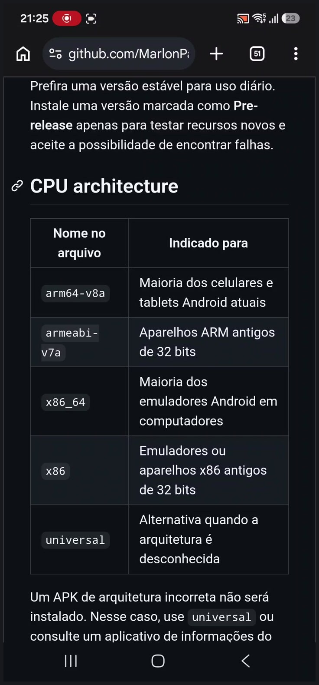
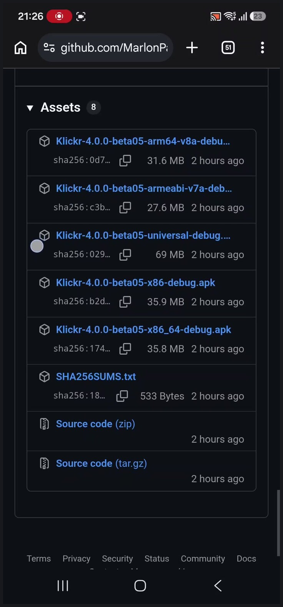
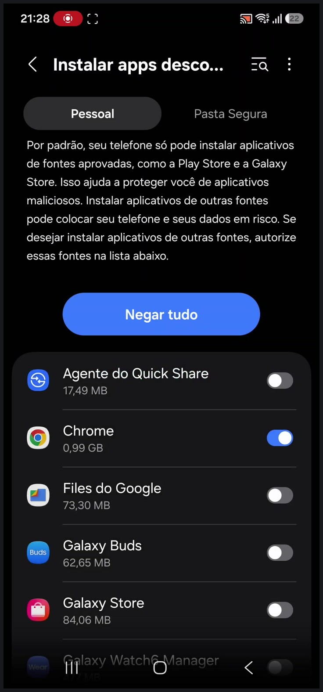
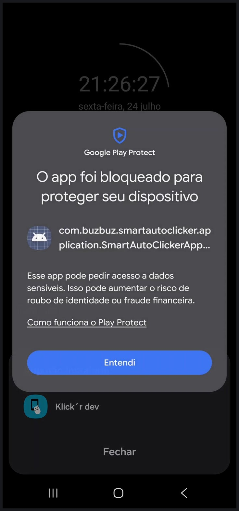
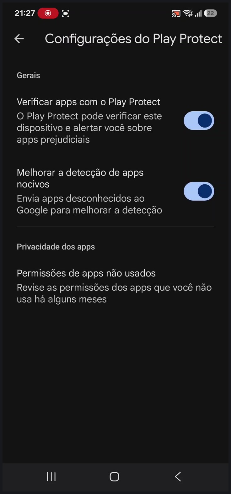
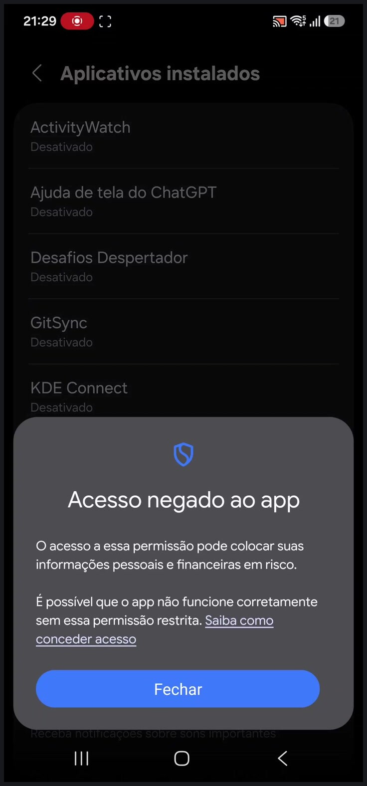
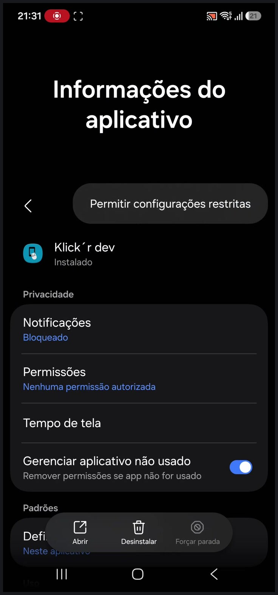
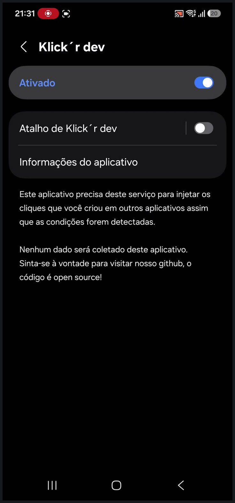
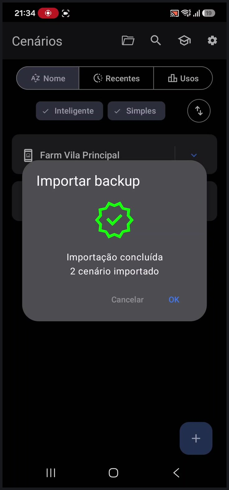

# Instalação e configuração do Klick'r no Android

Este guia mostra como baixar o APK correto nas
[releases do projeto](https://github.com/MarlonPassos-git/Smart-AutoClicker/releases),
instalá-lo com segurança, resolver os bloqueios mais comuns do Android e
importar um backup de cenários.

> [!IMPORTANT]
> Baixe o aplicativo somente pelas releases deste repositório. Este tutorial
> não orienta a instalação de aplicativos com nome parecido encontrados em
> lojas ou sites de download.

## Visão geral

O processo completo é:

1. escolher o APK compatível com o aparelho;
2. conferir a origem e, se possível, o hash do arquivo;
3. autorizar temporariamente a instalação pelo navegador ou gerenciador de
   arquivos;
4. instalar o APK;
5. resolver eventuais bloqueios do Play Protect;
6. permitir as configurações restritas no Android 13 ou superior;
7. ativar o serviço de acessibilidade do Klick'r;
8. importar um backup de cenários, se houver.

## 1. Escolher o APK correto

Você pode usar a página
[Qual APK devo instalar?](https://marlonpassos-git.github.io/Smart-AutoClicker/baixar-apk.html)
para receber uma recomendação e iniciar o download. Também é possível escolher
manualmente na página de uma release.

### Versão estável ou pré-release

- Prefira uma versão estável para uso diário.
- Use uma versão marcada como **Pre-release** somente para testar recursos
  novos. Ela pode conter falhas ou mudanças ainda não validadas.

### Arquitetura do processador

| Nome no arquivo | Indicado para |
| --- | --- |
| `arm64-v8a` | Maioria dos celulares e tablets Android atuais |
| `armeabi-v7a` | Aparelhos ARM antigos de 32 bits |
| `x86_64` | Maioria dos emuladores Android em computadores |
| `x86` | Emuladores ou aparelhos x86 antigos de 32 bits |
| `universal` | Alternativa quando a arquitetura é desconhecida |

Na maioria dos celulares atuais, escolha `arm64-v8a`. Se você não souber a
arquitetura, use `universal`. O arquivo será maior, mas contém todas as
arquiteturas disponíveis.



## 2. Baixar o arquivo certo

Na release escolhida:

1. abra a seção **Assets**;
2. toque no APK correspondente à arquitetura do aparelho;
3. aguarde o download terminar.

Baixe um arquivo com a extensão `.apk`. Não escolha:

- `Source code (zip)`;
- `Source code (tar.gz)`;
- `SHA256SUMS.txt`.

O arquivo `SHA256SUMS.txt` serve apenas para verificar a integridade dos APKs.



### Verificar a integridade do download

Cada release inclui um arquivo `SHA256SUMS.txt`. Em um computador, compare o
hash do APK baixado com o valor publicado.

No Linux:

```bash
sha256sum Klickr-*.apk
```

No PowerShell:

```powershell
Get-FileHash .\Klickr-*.apk -Algorithm SHA256
```

Os valores devem ser idênticos. Se forem diferentes, exclua o APK e faça o
download novamente pela página oficial da release.

## 3. Autorizar a instalação do APK

Abra o APK pela notificação de download ou pela pasta **Downloads**. Se o
Android pedir autorização para instalar aplicativos por essa fonte, permita
somente para o aplicativo que abriu o arquivo.

Por exemplo, se o download foi feito pelo Chrome:

1. abra **Configurações**;
2. acesse **Aplicativos**;
3. abra **Acesso especial**;
4. toque em **Instalar apps desconhecidos**;
5. selecione **Chrome**;
6. ative **Autorizar permissão** ou **Permitir desta fonte**.

Em aparelhos Samsung mais recentes, o caminho também pode aparecer como:

**Configurações → Segurança e privacidade → Mais configurações de segurança →
Instalar apps desconhecidos**.



> [!TIP]
> Depois da instalação, volte a essa tela e desative a permissão do Chrome ou
> do gerenciador de arquivos.

### Se o Bloqueador automático da Samsung impedir a instalação

Em versões recentes da One UI, o **Bloqueador automático** pode impedir a
instalação mesmo quando a origem já está autorizada.

Se isso acontecer:

1. abra **Configurações → Segurança e privacidade → Bloqueador automático**;
2. desative o recurso temporariamente;
3. instale o APK;
4. ative o Bloqueador automático novamente.

Desative essa proteção apenas depois de conferir a origem e a integridade do
APK. Consulte a
[orientação oficial da Samsung](https://www.samsung.com/ae/support/mobile-devices/how-to-enable-permission-to-install-apps-from-unknown-source-on-my-samsung-phone/).

## 4. Resolver o bloqueio do Play Protect

O Play Protect pode bloquear aplicativos instalados fora da Play Store que
solicitam permissões sensíveis, como o serviço de acessibilidade.



Antes de continuar:

1. confirme que o endereço é
   `github.com/MarlonPassos-git/Smart-AutoClicker`;
2. confirme que o arquivo foi baixado em **Releases → Assets**;
3. compare o SHA-256 com `SHA256SUMS.txt`, se possível.

### Último recurso: pausar o Play Protect

O recomendado é manter o Play Protect ativado. Se o APK verificado continuar
sendo bloqueado e a tela não oferecer uma opção para prosseguir:

1. abra a **Play Store**;
2. toque na foto do perfil;
3. acesse **Play Protect**;
4. toque na engrenagem;
5. desative temporariamente **Verificar apps com o Play Protect**;
6. escolha **Pausar** ou **Desativar** quando solicitado;
7. volte ao APK e faça a instalação;
8. reative o Play Protect imediatamente depois.

Não é necessário desativar **Melhorar a detecção de apps nocivos**.



O Google informa que o Play Protect é ativado por padrão e recomenda mantê-lo
ligado. Veja a
[documentação oficial do Google Play Protect](https://support.google.com/googleplay/answer/2812853).

## 5. Permitir as configurações restritas

No Android 13 ou superior, aplicativos instalados por APK podem ser impedidos
de ativar serviços sensíveis. Ao selecionar o Klick'r em **Acessibilidade**, a
seguinte mensagem pode aparecer:

> Acesso negado ao app. É possível que o app não funcione corretamente sem essa
> permissão restrita.



Para liberar o acesso:

1. abra **Configurações → Aplicativos**;
2. selecione **Klick'r**;
3. toque no menu de três pontos no canto superior direito;
4. escolha **Permitir configurações restritas**;
5. confirme o desbloqueio do aparelho, se solicitado.



Essa opção só deve ser ativada depois que a origem e a integridade do APK forem
conferidas. O
[Google explica os riscos das configurações restritas](https://support.google.com/android/answer/12623953)
e recomenda liberá-las somente para desenvolvedores confiáveis.

## 6. Ativar o serviço de acessibilidade

Depois de permitir as configurações restritas:

1. abra **Configurações → Acessibilidade**;
2. toque em **Aplicativos instalados**;
3. selecione **Klick'r**;
4. ative o serviço;
5. confirme o aviso do Android.



O Klick'r usa esse serviço para identificar o conteúdo da tela e executar os
cliques e gestos configurados nos cenários. Por isso, o Android trata essa
permissão como sensível.

## 7. Importar um backup de cenários

Se você recebeu ou exportou um backup:

1. salve o arquivo `.zip` no aparelho;
2. abra o Klick'r;
3. toque no ícone de pasta na parte superior da tela de cenários;
4. selecione o arquivo de backup `.zip`;
5. aguarde a verificação dos dados;
6. confirme a importação.

Não extraia o `.zip` antes de selecioná-lo no Klick'r, a menos que o arquivo
recebido contenha outro `.zip` dentro dele.



Ao terminar, os cenários importados aparecerão na tela inicial.


## Solução de problemas

### “App não instalado”

As causas mais comuns são:

- arquitetura incompatível: tente `universal`;
- download incompleto ou corrompido: baixe novamente;
- assinatura incompatível com uma instalação anterior: exporte um backup,
  desinstale a versão anterior e instale o novo APK;
- versão do Android incompatível com a release.

### “Acesso negado ao app”

Libere **Permitir configurações restritas** nas informações do aplicativo e
então volte para a tela de acessibilidade.

### A opção “Instalar apps desconhecidos” está bloqueada

Em aparelhos Samsung, verifique se o **Bloqueador automático** está ativo. Em
aparelhos corporativos, um perfil de trabalho ou uma política administrativa
também pode impedir instalações externas.

### Os cenários antigos não aparecem

Exporte o backup da instalação anterior e importe o arquivo manualmente na
instalação atual.

### O Play Protect continua bloqueando o aplicativo

Não procure outro APK em sites de download. Confirme o hash, a release e o
endereço do repositório. Se não for possível confirmar a origem do arquivo, não
prossiga com a instalação.
