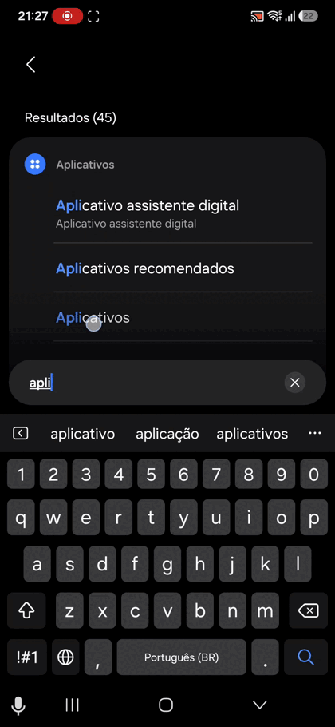
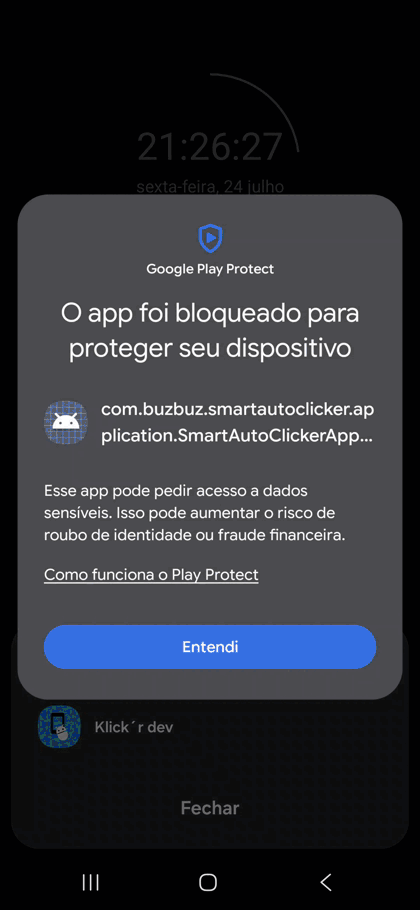
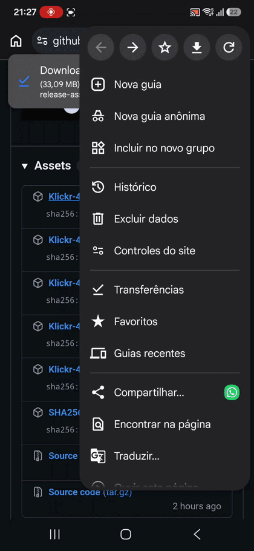
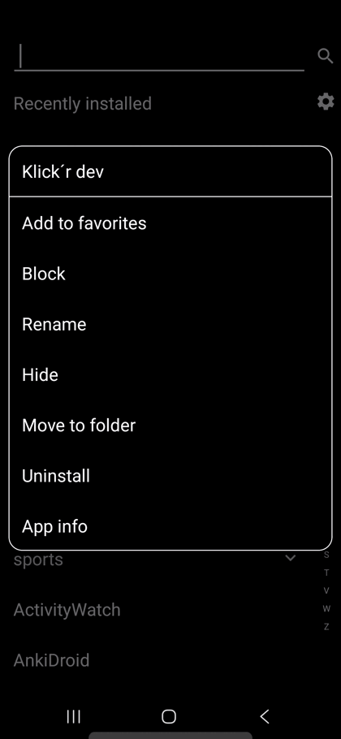
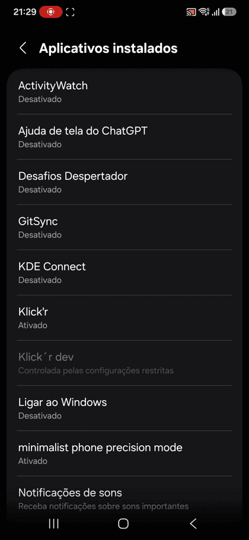
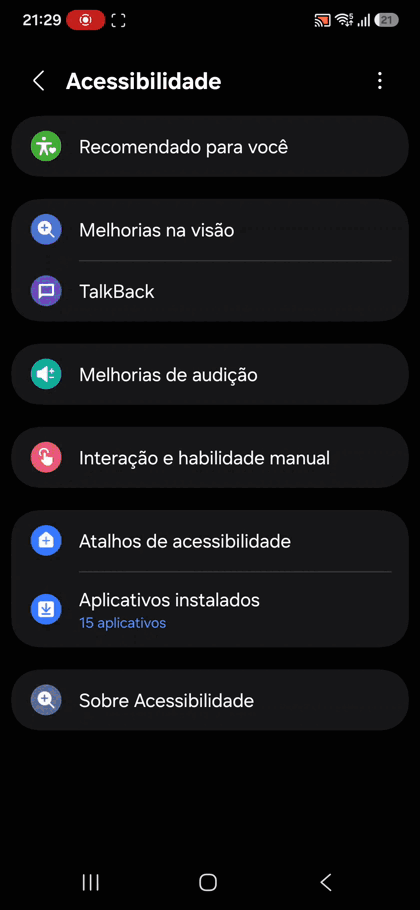

# Instalar o Klick'r no Android

Como o Klick'r ainda não está na Play Store, o Android pode bloquear a
instalação e algumas permissões. Siga as etapas abaixo na ordem.

## 1. Baixar o aplicativo

[Baixar o Klick'r pela página da versão](https://github.com/MarlonPassos-git/Smart-AutoClicker/releases/tag/4.0.0-beta05)

Baixe a versão compatível com seu celular. Se não souber qual escolher,
consulte [Qual APK devo instalar?](QUAL-APK-DEVO-INSTALAR.md).

## Antes da instalação

### 2. Permitir a instalação pelo navegador

1. Abra **Configurações → Aplicativos**.
2. Toque nos três pontos e depois em **Acesso especial**.
3. Abra **Instalar apps desconhecidos**.
4. Selecione o navegador usado para baixar o Klick'r.
5. Ative **Autorizar permissão**.

### 3. Desativar o Play Protect quando ele bloquear o app

Esta etapa só é necessária quando aparecer a mensagem **O app foi bloqueado
para proteger seu dispositivo**.

1. Abra a **Play Store**.
2. Toque na foto do perfil e abra **Play Protect**.
3. Toque na engrenagem.
4. Desative **Verificar apps com o Play Protect**.
5. Toque em **Desativar**.

### 4. Instalar o Klick'r

Abra o arquivo baixado e conclua a instalação. Ao terminar, o Android mostrará
a mensagem **App instalado**.

## Depois da instalação

### 5. Permitir notificações

1. Toque e segure o ícone do Klick'r.
2. Abra **Informações do aplicativo**.
3. Toque em **Notificações**.
4. Ative **Permitir notificações**.

### 6. Permitir sobreposição

Nas informações do Klick'r:

1. toque em **Aparecer sobre outros**;
2. ative **Autorizar permissão**.

O GIF mostra como abrir as informações do aplicativo e ativar a sobreposição.
A tela de notificações pode mudar conforme a versão do Android.

### 7. Permitir configurações restritas

1. Abra **Configurações → Aplicativos → Klick'r**.
2. Toque nos três pontos.
3. Selecione **Permitir configurações restritas**.
4. Confirme o desbloqueio do celular.

### 8. Ativar a acessibilidade

1. Abra **Configurações → Acessibilidade**.
2. Toque em **Aplicativos instalados**.
3. Selecione **Klick'r**.
4. Ative o serviço e confirme em **Permitir**.

Pronto. Abra o Klick'r e comece a criar seus cenários.
