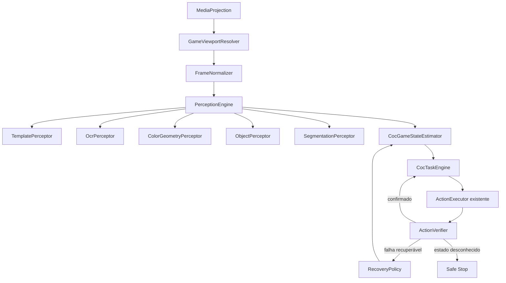

# Estudo: automação de Clash of Clans executada no Android

Status: proposta técnica para experimento  
Data da pesquisa: 22 de julho de 2026  
Escopo inicial: Clash of Clans em português do Brasil, executado integralmente no aparelho

## Resumo executivo

É tecnicamente viável especializar este fork para Clash of Clans sem depender de computador, ADB ou emulador. A base atual já fornece as partes difíceis de integração com Android: captura por `MediaProjection`, processamento nativo com OpenCV e ncnn, OCR, execução de gestos por `AccessibilityService`, eventos, condições, ações, cooldowns, contadores e relatórios.

A solução não deve substituir tudo por um único modelo de Object Detection. Arquitetura recomendada é híbrida:

- templates e âncoras para elementos visuais estáveis;
- OCR para botões, nomes, custos, níveis e estados;
- cor e geometria para indicadores simples;
- detecção neural para vários objetos simultâneos, como cards de tropas e construções;
- segmentação para objetos densos ou conectados, principalmente muros;
- máquina de estados determinística para decidir qual ação executar;
- confirmação visual obrigatória depois de cada ação relevante.

Modelos devem ser treinados fora do celular e usados somente para inferência local. ncnn é o primeiro runtime a avaliar porque já está integrado ao projeto. O build atual, porém, desativa Vulkan, FP16 e INT8; desempenho e aceleração precisam ser medidos antes de qualquer decisão.

“Funcionar em qualquer aparelho” deve ser formalizado como uma matriz de suporte verificada. O sistema precisa detectar o viewport real do jogo, usar coordenadas normalizadas, calibrar captura e gestos, selecionar um perfil de inferência e parar com segurança quando não reconhecer o estado.

## Limites do estudo

Este documento cobre:

- comparação com projetos públicos de automação de Clash of Clans;
- arquitetura Android-only para este fork;
- portabilidade entre resoluções, proporções e capacidades de hardware;
- escolha entre template matching, OCR, Object Detection e segmentação;
- coleta, rotulagem, treinamento, empacotamento e avaliação de modelos;
- desenho inicial de farming, upgrades, muros e Jogos do Clã;
- roadmap e critérios de aceite.

Não cobre:

- técnicas para esconder automação ou contornar mecanismos anti-cheat;
- exploração de falhas do jogo;
- obtenção ou uso de credenciais;
- distribuição de assets extraídos do APK;
- promessa de publicação na Google Play.

## Restrição de produto e distribuição

A restrição principal não é técnica. A [Safe and Fair Play Policy da Supercell](https://supercell.com/en/safe-and-fair-play/) classifica bots, serviços de automação e scripts de gameplay como software proibido e informa que a consequência pode ser banimento permanente. A [Fan Content Policy](https://supercell.com/en/fan-content-policy/) também proíbe usar assets da Supercell em conexão com bots ou software de automação.

A [política da Google Play para AccessibilityService](https://support.google.com/googleplay/android-developer/answer/10964491) permite automação determinística e limitada, mas proíbe uso que permita ao aplicativo iniciar, planejar e executar autonomamente ações ou decisões. O conjunto completo de funcionalidades proposto tem alto risco de não ser aceito na loja.

Consequências para o projeto:

- tratar implementação como pesquisa local e não como produto publicável;
- usar somente contas descartáveis de teste, entendendo que isso não elimina violação dos termos;
- não incluir assets extraídos do APK no repositório ou em releases;
- não construir funcionalidades de evasão de detecção;
- separar decisão técnica de eventual autorização jurídica ou comercial.

## Auditoria da base atual

### Capacidades reutilizáveis

| Capacidade | Evidência atual | Uso no fork CoC |
| --- | --- | --- |
| Captura de tela | [`DisplayRecorder`](../../core/common/display/src/main/java/com/buzbuz/smartautoclicker/core/display/recorder/DisplayRecorder.kt) usa `MediaProjection` e `VirtualDisplay` | Entrada de frames sem computador |
| Gestos Android | [`SmartAutoClickerService`](../../smartautoclicker/src/main/java/com/buzbuz/smartautoclicker/SmartAutoClickerService.kt) e [`ActionExecutor`](../../core/smart/processing/src/main/java/com/buzbuz/smartautoclicker/core/processing/data/processor/ActionExecutor.kt) | Toque, swipe, zoom e ações de sistema |
| Template matching | [`template_matcher.cpp`](../../core/smart/detection/src/main/cpp/detector/matching/template/template_matcher.cpp) usa `cv::matchTemplate` com `TM_CCOEFF_NORMED` | Estados, ícones e popups estáveis |
| OCR local | [`ImageDetector`](../../core/smart/detection/src/main/java/com/buzbuz/smartautoclicker/core/detection/ImageDetector.kt) carrega modelos ncnn de detecção e reconhecimento | Textos e números em pt-BR sem nuvem |
| Vários alfabetos | [`OCRAlphabet`](../../core/smart/detection-models/src/main/java/com/buzbuz/smartautoclicker/code/smart/detectionmodels/text/domain/OCRAlphabet.kt) | Expansão futura para outros idiomas |
| Condições | [`ScreenCondition`](../../core/smart/domain/src/main/java/com/buzbuz/smartautoclicker/core/domain/model/condition/ScreenCondition.kt) oferece imagem, texto, número e cor | Percepção híbrida já modelada |
| Múltiplas referências | [`ScreenCondition.Image`](../../core/smart/domain/src/main/java/com/buzbuz/smartautoclicker/core/domain/model/condition/ScreenCondition.kt) aceita 1–20 referências ordenadas | Variações de herói, botão, tema e atualização |
| Motor de cenário | [`ScenarioProcessor`](../../core/smart/processing/src/main/java/com/buzbuz/smartautoclicker/core/processing/data/processor/ScenarioProcessor.kt) verifica eventos e executa ações | Base para fluxos determinísticos |
| Escalonamento | [`ScalingManager`](../../core/smart/processing/src/main/java/com/buzbuz/smartautoclicker/core/processing/data/scaling/ScalingManager.kt) reduz frame e coordenadas pela qualidade | Reutilizável, mas insuficiente para viewport do jogo |
| Debug e relatórios | [`core/smart/debugging`](../../core/smart/debugging) | Diagnóstico e telemetria local de sessões |

O projeto usa Android mínimo 24, OpenCV 4.12.0 e ncnn 20260113 conforme [`libs.versions.toml`](../../gradle/libs.versions.toml). Configuração nativa atual em [`core/smart/detection/build.gradle.kts`](../../core/smart/detection/build.gradle.kts) desativa Vulkan, FP16 e INT8. Primeiro protótipo neural deve funcionar em CPU; aceleração deve ser uma otimização posterior e condicionada por compatibilidade.

### Lacunas reais

1. `DetectionResult` representa uma única posição, tamanho e confiança. Object Detection exige uma lista de caixas, classes e scores.
2. Múltiplas Reference Images são alternativas sequenciais e encerram na primeira detecção. Isso aumenta robustez, mas não encontra várias instâncias.
3. Escalonamento atual usa tamanho total do display. Não resolve barras do sistema, cutouts, captura apenas do app, letterboxing ou viewport variável.
4. Eventos genéricos não representam explicitamente estados do Clash, objetivos, inventário de tropas, construtores ou recursos.
5. Relatório atual não substitui dataset reproduzível de frames e ações para replay offline.
6. Não existe contrato versionado para modelos, labels, templates, traduções, thresholds e versão compatível do jogo.

### Aprendizado do cenário existente

Histórico do projeto registra que recorte da Rainha Arqueira incluía elementos variáveis, como patch e número do nível. Reduzir threshold mascarou o problema; solução mais correta foi recortar área estável, usar texto quando semântica era textual e adicionar referências equivalentes.

Isso sustenta três regras:

- não usar modelo neural para elemento resolvido de forma confiável por OCR ou template estável;
- não capturar referência contendo nível, badge, cooldown ou decoração variável sem necessidade;
- testar uma condição em várias sessões e aparelhos antes de considerá-la reutilizável.

Decisão de persistir Reference Images individualmente já está documentada em [ADR 0001](../adr/0001-normalize-image-references.md).

## Projetos pesquisados

### Matriz comparativa

| Projeto | Execução | Percepção | Pontos aproveitáveis | Limitação para objetivo atual |
| --- | --- | --- | --- | --- |
| [anugrhaswi/Coc-Auto-Farm](https://github.com/anugrhaswi/Coc-Auto-Farm) | Windows + LDPlayer | YOLO + EasyOCR | Separação entre visão, automação e loop; caixas classificadas; retries | Modelo `best.pt` não é fornecido; apenas goblins; sem testes formais; depende de janela e PC |
| [m24842/CoC_Bot](https://github.com/m24842/CoC_Bot) | macOS/Windows + BlueStacks + ADB | Templates, OCR, cor, Sobel e Canny | Muitas features; upgrade por lista; identificação estrutural dos cards; coordenadas normalizadas em partes do código | Perfil fixo 1920×1080, 60 FPS e cenários específicos; processamento fica no computador |
| [TuDePi/clash-of-clans-bot](https://github.com/TuDePi/clash-of-clans-bot) | Python + ADB | Templates, OCR, HSV e morfologia | Máquina de estados; popups prioritários; busca múltipla com supressão de duplicatas; calibrador de regiões | Templates precisam ser capturados para dispositivo; ferramenta de calibração roda no computador |
| [ChackBR/MyBot_v7](https://github.com/ChackBR/MyBot_v7) | Windows/emulador | ImageSearch/OpenCV e grande catálogo visual | Separação de módulos por tropa, ataque, upgrade e recursos; experiência acumulada de domínio | Base antiga, assets extensos e dependência de ambiente fixo |
| [thomaslienbacher/CoCBot](https://github.com/thomaslienbacher/CoCBot) | Host Windows + cliente Android | OpenCV + Tesseract | Pipeline claro de screenshot, interpretação e toque ADB | Android funciona apenas como alvo; visão continua no host |
| [syskraken/krakenprime](https://github.com/syskraken/krakenprime) | Windows + LDPlayer + ADB | Visão baseada em tela | Referência recente de automação CoC | Exige 1600×900 e 240 DPI; evidencia fragilidade de configuração fixa |
| [MaaXYZ/MaaFramework](https://github.com/MaaXYZ/MaaFramework) | Windows, Linux, macOS e Android | Templates, features, OCR, cor e redes neurais | Pipeline declarativo; ROI, caixa, alvo, timeout, erro, estabilização, múltiplos resultados e ordenação | Framework genérico; não autoriza uso que viole termos de terceiros |

### Lições importáveis

De `Coc-Auto-Farm`:

- contrato de percepção deve retornar `classId`, `bounds` e `confidence`;
- retries pertencem ao fluxo, não devem ser sleeps espalhados;
- modelo, labels e configurações precisam ser versionados juntos.

De `m24842/CoC_Bot`:

- barra de tropas pode ser detectada pela estrutura dos cards antes de reconhecer cada ícone;
- upgrades são mais confiáveis pela lista do construtor que procurando visualmente toda a vila;
- processamento em lote de templates reduz custo;
- resultado múltiplo é necessário para tropas, construções e muros;
- resolução fixa não deve entrar no novo domínio.

Fontes específicas: [README e perfil 1920×1080](https://github.com/m24842/CoC_Bot/blob/main/README.md), [detecção estrutural e uso da barra de tropas](https://github.com/m24842/CoC_Bot/blob/main/src/attacker.py) e [fluxos de upgrade](https://github.com/m24842/CoC_Bot/blob/main/src/upgrader.py).

De `TuDePi/clash-of-clans-bot`:

- estado global precisa ser conhecido antes de executar qualquer task;
- interrupções e popups têm prioridade;
- NMS ou estratégia equivalente evita vários matches do mesmo elemento;
- regiões proporcionais ajudam, mas calibração por usuário ainda é sinal de que viewport não foi resolvido de forma geral.

Fontes específicas: [máquina de estados](https://github.com/TuDePi/clash-of-clans-bot/blob/main/bot/state_machine.py), [visão e detecções múltiplas](https://github.com/TuDePi/clash-of-clans-bot/blob/main/bot/vision.py) e [calibração de regiões](https://github.com/TuDePi/clash-of-clans-bot/blob/main/tools/calibrate_regions.py).

De `MaaFramework`:

- separar `roi`, caixa reconhecida e alvo da ação;
- representar fluxo como grafo com `next`, `on_error`, timeout e retry;
- aguardar estabilização visual é melhor que pausa fixa;
- permitir vários mecanismos de reconhecimento sob mesmo contrato;
- ordenar detecções por confiança, posição, área ou classe esperada.

Fonte: [Pipeline Protocol](https://github.com/MaaXYZ/MaaFramework/blob/main/docs/en_us/3.1-PipelineProtocol.md).

## Arquitetura proposta



### Responsabilidades

`GameViewportResolver`

- detecta retângulo útil do Clash dentro da captura;
- diferencia captura da tela inteira e captura isolada do app;
- remove influência de barras, cutouts e letterboxing;
- mantém transformação reversível entre pixels físicos e coordenadas do jogo.

`FrameNormalizer`

- aplica rotação conhecida;
- preserva proporção e adiciona padding em vez de deformar;
- gera entrada canônica para templates, OCR e modelo;
- expõe ROIs ancoradas no viewport.

`PerceptionEngine`

- executa somente perceptores necessários ao estado atual;
- retorna resultados com origem, classe, caixa, score e timestamp;
- permite combinar evidências, por exemplo template de ícone e OCR do título;
- mantém detalhes do OpenCV/ncnn fora da camada de tarefas.

`CocGameStateEstimator`

- representa estados como `HomeVillage`, `ArmyOverview`, `AttackSearch`, `Battle`, `BattleResult`, `BuilderMenu`, `ClanGames`, `Popup`, `Loading` e `Unknown`;
- exige evidência positiva para transições importantes;
- prioriza popup, desconexão e manutenção;
- usa histórico curto para evitar alternância causada por um único frame ruim.

`CocTaskEngine`

- executa tarefas determinísticas e configuradas pelo usuário;
- define pré-condições, passos, pós-condições, timeout e recuperação;
- não conhece pixels nem detalhes de modelo;
- compõe tasks menores em farming, upgrades, muros e Jogos do Clã.

`ActionVerifier`

- confirma mudança de estado ou elemento esperado depois de cada ação;
- diferencia gesto enviado de gesto efetivamente aplicado;
- impede sequência de cliques quando tela ficou parada, mudou para popup ou saiu do jogo.

## Portabilidade entre aparelhos

### Definição de suporte

“Suportado” deve significar que uma combinação foi executada por suíte de replay e teste físico:

- versão Android;
- arquitetura de CPU;
- resolução e proporção;
- densidade e tamanho físico;
- modo de captura da tela inteira ou do app;
- qualidade gráfica do jogo;
- idioma;
- versão do Clash;
- backend de inferência selecionado.

Não é correto inferir suporte a 1440p porque 1080p passou, nem suporte a aparelho Samsung porque um aparelho Motorola de mesma resolução passou.

### Sistema de coordenadas

Coordenadas devem seguir três espaços explícitos:

1. `ScreenPx`: pixels reais da captura.
2. `ViewportNormalized`: valores de 0 a 1 relativos ao conteúdo do jogo.
3. `ModelInputPx`: tensor redimensionado e letterboxed para o modelo.

Toda detecção volta para `ViewportNormalized`; somente executor converte para `ScreenPx`. Persistência de tasks nunca deve guardar pixel físico do aparelho.

### Âncoras e ROIs

ROIs devem ser derivadas de elementos estáveis:

- barra de tropas ancorada na borda inferior do viewport;
- botão de ataque ancorado no canto inferior esquerdo;
- recursos ancorados na parte superior;
- painel de objeto selecionado ancorado no rodapé;
- popups ancorados no centro.

Se âncora não for encontrada, ROI dependente não deve ser usada.

### Assistente de compatibilidade

Primeira execução deve:

1. solicitar captura com consentimento do Android;
2. abrir Clash e detectar viewport;
3. validar que toque de teste pode ser confirmado sem comprar ou gastar recurso;
4. medir latência de template, OCR e modelo;
5. selecionar resolução de entrada e backend;
6. salvar `DeviceCapabilityProfile`;
7. informar funcionalidades habilitadas ou indisponíveis.

Android 14+ exige consentimento por sessão de `MediaProjection`, conforme [documentação oficial](https://developer.android.com/media/grow/media-projection). Captura isolada do app pode excluir barras do sistema e mudar dimensões durante sessão; resolver viewport continua necessário.

## Estratégia de percepção

| Problema | Técnica primária | Evidência secundária | Modelo neural? |
| --- | --- | --- | --- |
| Tela inicial | Templates de âncoras | OCR de botão e recursos | Não inicialmente |
| Botões textuais | OCR em ROI | Cor/forma do botão | Não |
| Recursos e custos | OCR numérico | Posição e ícone do recurso | Não |
| Popups | Múltiplas Reference Images | OCR do título | Não inicialmente |
| Cards visíveis | Bordas/estrutura da barra | Detector de classe | Provável |
| Herói disponível | Detector/classificador do card | Referências por estado | Provável, depois do baseline |
| Construções da vila | Detector de objetos | Painel após seleção | Sim |
| Segmentos de muro | Segmentação | Confirmação “Muro” no painel | Sim |
| Nível e custo do muro | OCR no painel | Estado do botão | Não |
| Desafios dos Jogos do Clã | OCR e layout | Ícone da categoria | Não inicialmente |

### Contrato de detecção plural

Contrato conceitual:

```kotlin
data class CocDetection(
    val classId: String,
    val bounds: RectF,
    val confidence: Float,
    val source: CocPerceptionSource,
)
```

Resultado deve permitir:

- zero ou mais detecções;
- NMS por classe;
- ordenação espacial ou por confiança;
- filtro por ROI e classe esperada;
- retorno de `Unknown` quando score não atingir limiar;
- métricas de latência e backend.

Esse contrato não deve substituir `DetectionResult` imediatamente. Uma interface de domínio própria evita quebrar condições genéricas antes do experimento provar valor.

## Estratégia de modelos

### Treinamento e inferência

Treino ocorre fora do aparelho:

1. gravar sessões reais autorizadas pelo usuário;
2. remover ou mascarar nomes, chats e notificações;
3. selecionar frames sem redundância excessiva;
4. rotular objetos ou máscaras;
5. dividir dataset por sessão e aparelho;
6. treinar, avaliar e exportar;
7. converter para runtime móvel;
8. executar benchmark e replay no Android.

Celular apenas carrega modelo e faz inferência. Treinar dentro do app aumentaria consumo, complexidade e variabilidade sem resolver falta de dados rotulados.

### Modelos separados

Não usar um modelo único para tudo. Proposta inicial:

- `troop-card-detect`: cards, tipo geral e disponibilidade;
- `troop-icon-classify`: classe específica do crop de um card;
- `village-object-detect`: construções candidatas;
- `wall-segment`: máscara ou boxes de segmentos de muro.

Separação permite atualizar muros sem retreinar cards, diminuir memória e executar somente modelo necessário.

### Runtime

ncnn deve ser baseline porque projeto já possui integração C++/JNI e modelos OCR no mesmo formato. [ncnn](https://github.com/Tencent/ncnn) suporta Android, CPU ARM e Vulkan, além de conversão por pnnx/ONNX.

Plano de decisão:

1. exportar modelo pequeno para ncnn;
2. medir CPU no aparelho intermediário mais antigo da matriz;
3. comparar entrada 320, 416 e 640 sem alterar dataset;
4. só então testar FP16, INT8 e Vulkan;
5. manter fallback CPU para drivers incompatíveis;
6. rejeitar backend que mude precisão além do limite definido.

[LiteRT ObjectDetector](https://ai.google.dev/edge/litert/libraries/task_library/object_detector) é alternativa se ncnn exigir muito pós-processamento ou apresentar incompatibilidades. Trocar runtime antes de benchmark duplicaria integração.

Treinador deve ficar atrás de pipeline próprio. Ultralytics facilita YOLO e exportação ncnn, mas [código e modelos possuem condições AGPL/Enterprise](https://github.com/ultralytics/ultralytics). Licença precisa ser decidida antes de consolidar ferramenta e pesos no fluxo.

## Resource Pack do Clash

Aplicativo e recursos do jogo mudam em ritmos diferentes. Modelos, templates, textos e thresholds devem formar pacote versionado.

Estrutura conceitual:

```text
coc-resource-pack/
├── manifest.json
├── labels/
│   └── pt-BR.json
├── models/
│   ├── troop-card-detect.ncnn.param
│   ├── troop-card-detect.ncnn.bin
│   └── wall-segment.*
├── templates/
│   └── pt-BR/
├── states/
│   └── state-evidence.json
└── thresholds/
    └── defaults.json
```

Manifesto mínimo:

```json
{
  "schemaVersion": 1,
  "packVersion": "0.1.0",
  "locale": "pt-BR",
  "gameVersionRange": {
    "min": "unknown",
    "max": "unknown"
  },
  "models": [],
  "templates": [],
  "sha256": {}
}
```

Requisitos:

- hash por arquivo;
- versão de schema independente;
- labels estáveis que não dependam do texto traduzido;
- compatibilidade explícita com versão do app e do jogo;
- rollback para último pack conhecido;
- pacote bootstrap incluído no APK durante protótipo;
- download assinado somente em fase posterior;
- nenhum asset extraído do APK distribuído sem autorização.

### Catálogo semântico de tropas e interface

“Suportar qualquer tropa” não deve significar embutir coordenadas ou imagens diretamente nas regras. Resource Pack precisa oferecer catálogo semântico, separado dos modelos:

```text
catalog/
├── units.json
├── heroes.json
├── spells.json
├── siege-machines.json
├── ui-elements.json
├── game-states.json
└── clan-game-challenges.json
```

Entrada conceitual de unidade:

```json
{
  "id": "archer_queen",
  "category": "hero",
  "names": {
    "pt-BR": ["Rainha Arqueira"]
  },
  "perceptionClasses": ["hero_archer_queen", "hero_unknown"],
  "availabilityStates": ["ready", "cooldown", "upgrading", "unknown"],
  "deploymentProfiles": ["edge", "corner"],
  "introducedIn": "unknown"
}
```

Entrada conceitual de elemento da interface:

```json
{
  "id": "attack_button",
  "states": ["home_village"],
  "labels": {
    "pt-BR": ["Atacar"]
  },
  "perception": ["ocr", "template"],
  "anchor": "viewport_bottom_left",
  "action": "open_attack_menu"
}
```

O catálogo registra identidade, traduções, estados e comportamento; não precisa conter arte oficial. Templates permanecem arquivos privados do pack experimental e cada origem precisa ser auditável. Novas tropas podem entrar no catálogo antes de o classificador reconhecê-las, mas ficam `unknown` na execução até haver evidência validada.

Primeira versão deve catalogar categorias completas — tropas, heróis, feitiços e máquinas de cerco — mas pode liberar suporte de implantação por grupos. “Conhecido pelo catálogo” e “automatizado com segurança” são estados diferentes e devem aparecer separadamente na interface.

## Modelo de domínio CoC

Entidades mínimas:

- `CocGameState`: estado visual atual e evidências;
- `CocResourceBalance`: ouro, elixir, elixir negro e capacidade;
- `CocArmySlot`: posição, tipo, classe, quantidade e disponibilidade;
- `CocHeroState`: disponível, em upgrade, derrotado ou desconhecido;
- `CocBuilderState`: construtores livres e ocupados;
- `CocUpgradeCandidate`: nome, nível, custo, recurso e prioridade;
- `CocClanGameChallenge`: nome lido, categoria, progresso e suporte;
- `CocTaskRun`: task, passo atual, tentativas, deadline e último erro;
- `CocDeviceCapabilityProfile`: viewport, backend e latências;
- `CocResourcePackVersion`: versão ativa e compatibilidade.

Textos traduzidos ficam fora das regras. Task deve usar `attack_button`, não string `Atacar`; pack pt-BR resolve label para uma ou mais alternativas OCR.

## Desenho das funcionalidades

### Farming com exército variável

Fluxo:

1. confirmar `HomeVillage`;
2. ler disponibilidade de exército e heróis;
3. abrir busca de ataque;
4. confirmar `AttackSearch`;
5. ler recursos e aplicar regra de alvo;
6. procurar outra vila ou iniciar ataque;
7. detectar barra e cards visíveis;
8. executar estratégia declarada para os tipos encontrados;
9. confirmar fim e retorno;
10. registrar resultado e motivo de qualquer fallback.

Estratégia não deve codificar “card 1 é goblin”. Deve operar sobre classes semânticas e permitir `unknown_troop`. Card desconhecido não é utilizado automaticamente.

Primeiro experimento deve resolver exatamente dor atual: heróis e cards em diferentes aparelhos. Templates estáveis e múltiplas referências formam baseline; detector neural só vence se apresentar menos falsos negativos e custo aceitável.

### Upgrade automático

Priorizar lista do construtor ou menu de sugestões:

1. abrir lista;
2. detectar linhas visíveis;
3. OCR do nome, nível e custo;
4. aplicar prioridades do usuário;
5. abrir candidato;
6. validar tela de confirmação;
7. comparar saldo e reservar construtor;
8. confirmar upgrade;
9. verificar redução de recurso ou construtor ocupado.

Procurar cada prédio diretamente na vila fica como fallback futuro, não MVP.

### Upgrade de muros

Muro exige percepção especializada porque segmentos são densos, isométricos e parcialmente cobertos.

Fluxo proposto:

1. confirmar vila e ausência de popup;
2. segmentar ou detectar candidatos visíveis;
3. ordenar candidatos por confiança e acessibilidade;
4. tocar em um candidato;
5. exigir OCR `Muro` no painel selecionado;
6. ler nível, custo e recurso disponível;
7. verificar regra de reserva de ouro/elixir;
8. executar upgrade;
9. confirmar mudança do painel/saldo;
10. marcar região tratada e avançar.

Modelo não precisa classificar todos os níveis visualmente. Painel do próprio jogo fornece semântica mais confiável depois da seleção. Se toque selecionar outro objeto, candidato é rejeitado sem gastar recurso.

### Jogos do Clã

Desafios são catálogo aberto. Primeira versão deve automatizar apenas desafios reconhecidos e mapeados para uma task existente.

Fluxo:

1. abrir Jogos do Clã;
2. OCR dos cards visíveis;
3. normalizar texto para `challengeId` conhecido;
4. filtrar por suporte, duração e preferências;
5. aceitar desafio;
6. executar task associada;
7. verificar progresso;
8. coletar ou encerrar quando aplicável.

Primeiro conjunto sugerido:

- realizar ataques multiplayer;
- ganhar estrelas;
- usar tipo de tropa suportado;
- destruir construção cuja percepção já esteja validada.

Desafio desconhecido deve ser ignorado. Cancelamento automático não entra no primeiro experimento por poder gerar cooldown ou perda de oportunidade.

## Dados, gravação e replay

### Session Recorder

Modo de pesquisa deve registrar:

- frame ou crop relevante;
- timestamp monotônico;
- viewport e dimensões físicas;
- modelo, pack e backend ativos;
- estado estimado e evidências;
- detecções completas;
- ação solicitada e callback do gesto;
- estado observado depois da ação;
- metadados não identificadores do aparelho.

Chat, nome, clã, notificações e identificadores devem ser mascarados antes de exportar. Upload nunca pode ser implícito.

### Replay Runner

Replay alimenta frames gravados na percepção sem abrir o Clash. Deve reproduzir:

- ordem temporal;
- viewport original;
- pack/modelo selecionado;
- resultados esperados por frame;
- transições de estado esperadas;
- decisão de task sem executar gestos reais.

Isso transforma atualização de template/modelo em teste determinístico e reduz risco de gastar recursos durante desenvolvimento.

### Divisão do dataset

Frames consecutivos são quase duplicados. Divisão aleatória por imagem provoca vazamento entre treino e validação. Separar por sessão e aparelho:

- treino: sessões e aparelhos conhecidos;
- validação: sessões diferentes nos mesmos aparelhos;
- teste de generalização: aparelhos inteiros nunca vistos no treino;
- teste de atualização: versão ou tema do jogo não usado no treino.

Augmentations úteis: resize com preservação de proporção, brilho, gamma, compressão, blur leve, variação de cor e recorte de bordas. Augmentation não substitui captura real em outro aparelho.

## Testes e métricas

### Métricas de percepção

- precisão, recall e F1 por classe;
- mAP para detector, quando aplicável;
- IoU ou Dice para segmentação de muros;
- taxa de estado `Unknown`;
- falso positivo por mil frames;
- acurácia OCR por campo e não apenas por caractere.

### Métricas de automação

- ações confirmadas / ações enviadas;
- recuperações bem-sucedidas / falhas recuperáveis;
- cliques emitidos em estado incorreto: meta zero;
- gastos não previstos: meta zero;
- tempo até recuperação;
- taxa de conclusão por task e por aparelho.

### Métricas móveis

- latência p50/p95 por perceptor;
- memória nativa e Java;
- consumo de CPU/GPU;
- temperatura e throttling em sessões de 15, 30 e 60 minutos;
- impacto em bateria;
- tamanho do APK e do Resource Pack.

### Gates iniciais

1. Estado da tela: pelo menos 99% de acerto no conjunto de replay suportado.
2. Ação destrutiva: zero execução quando estado ou alvo estiver `Unknown`.
3. Portabilidade: mesma task passa sem editar coordenadas em 720p, 1080p e 1440p da matriz.
4. Generalização: resultado publicado separadamente para aparelhos vistos e não vistos no treino.
5. Desempenho: p95 definido por modelo de aparelho, sem congelar UI ou causar throttling contínuo.
6. Recuperação: todo passo possui timeout e transição explícita de erro.

Mudanças futuras de código exigirão testes nos diretórios `__tests__` conforme regras do projeto. Este estudo é somente Markdown, portanto não adiciona teste executável.

## Roadmap recomendado

### Fase 0 — decisão de continuidade

Entregas:

- aceitar formalmente risco de ToS e distribuição;
- definir uso apenas experimental;
- escolher aparelhos e contas descartáveis;
- definir quais dados podem ser gravados.

Gate: projeto não avança para automação real sem decisão explícita sobre risco.

### Fase 1 — recorder e replay

Entregas:

- formato versionado de sessão;
- mascaramento de regiões sensíveis;
- captura manual de estados pt-BR;
- runner offline;
- primeiro conjunto dourado.

Gate: mudança de template pode ser avaliada sem abrir jogo.

### Fase 2 — viewport universal

Entregas:

- `GameViewportResolver`;
- transformações `ScreenPx ↔ ViewportNormalized ↔ ModelInputPx`;
- ROIs ancoradas;
- perfil de compatibilidade;
- testes com captura inteira e captura do app.

Gate: cenário simples reconhece e toca mesmo alvo em três classes de resolução sem editar configuração.

### Fase 3 — percepção CoC

Entregas:

- contrato plural `CocDetection`;
- adaptadores de template, OCR, cor e objeto;
- estimador de estado;
- `ActionVerifier` e `Safe Stop`;
- formato inicial de Resource Pack.

Gate: replay de estados e popups atende métricas sem modelo de muro.

### Fase 4 — farming e heróis

Entregas:

- detecção estrutural da barra;
- baseline com referências múltiplas;
- modelo experimental de cards;
- estratégias declarativas;
- suporte a `unknown_troop`;
- confirmação de batalha e resultado.

Gate: mesma composição de exército executa em aparelhos suportados; modelo neural só é mantido se superar baseline.

### Fase 5 — muros

Entregas:

- dataset de muros por nível, cenário e CV;
- detector/segmentador;
- confirmação OCR do painel;
- regras de reserva de recurso;
- prevenção de seleção repetida.

Gate: zero upgrade de objeto não-muro em conjunto de teste e sessão física controlada.

### Fase 6 — upgrades gerais

Entregas:

- leitura da lista do construtor;
- prioridades configuráveis;
- validação de custo e construtor;
- histórico de decisões.

Gate: upgrades escolhidos correspondem às prioridades e reservas em todos casos de replay.

### Fase 7 — Jogos do Clã

Entregas:

- catálogo pt-BR de desafios;
- parser OCR e normalização;
- associação desafio → task;
- lista explícita de desafios não suportados.

Gate: somente desafios reconhecidos são aceitos e progresso é verificado.

### Fase 8 — idiomas e atualização de packs

Entregas:

- labels semânticas independentes de idioma;
- packs de tradução;
- compatibilidade com versão do jogo;
- atualização assinada e rollback.

Gate: novo idioma não exige fork das regras de task.

## Ordem de implementação sugerida

1. Recorder/replay.
2. Viewport e coordenadas normalizadas.
3. Estado global e Safe Stop.
4. Resultado plural e Resource Pack.
5. Barra de tropas/heróis.
6. Farming completo.
7. Muros.
8. Upgrades gerais.
9. Jogos do Clã.
10. Outros idiomas.

Começar por modelo de muros antes de replay e viewport produziria demo isolada, não plataforma reutilizável.

## Decisões propostas

| Tema | Decisão proposta | Motivo |
| --- | --- | --- |
| Execução | Integralmente no Android | Requisito principal |
| Percepção | Híbrida | Nenhum algoritmo é melhor para todos elementos |
| Treinamento | Fora do aparelho | Dados, custo e reprodutibilidade |
| Runtime inicial | ncnn em CPU | Dependência já existe e oferece menor integração inicial |
| Aceleração | Benchmark antes de Vulkan/FP16/INT8 | Compatibilidade varia entre aparelhos |
| Coordenadas | Viewport normalizado | Remove dependência de resolução física |
| Fluxo | Máquina de estados determinística | Recuperação auditável e alinhamento com Play policy, embora não garanta aprovação |
| Atualização | Resource Pack versionado | Jogo muda mais rápido que app |
| Muros | Segmentação + confirmação OCR | Cena densa; painel fornece semântica confiável |
| Upgrades | Lista do construtor primeiro | Mais confiável que localizar prédio na vila |
| Idioma inicial | pt-BR | Reduz variabilidade do primeiro conjunto de dados |
| Falha | Safe Stop | Evita cliques e gastos em estado desconhecido |

## Questões ainda abertas

- pesquisa deve permanecer privada ou existe intenção futura de distribuição?
- quais aparelhos físicos formarão primeira matriz?
- quais versões, níveis de Centro de Vila e cenários precisam entrar no MVP?
- dados poderão ser gravados apenas localmente ou exportados manualmente?
- modelo deve reconhecer identidade exata de toda tropa ou somente tipo/posição no primeiro experimento?
- farming atual deve ser migrado para camada CoC ou permanecer como cenário genérico durante transição?
- Resource Pack será sempre embutido ou precisa atualização independente no protótipo?

Essas questões não impedem Fases 1 e 2. Mudam escopo de modelos, distribuição e dataset a partir da Fase 3.

## Critério de conclusão do estudo

Estudo considera direção técnica definida quando houver decisão sobre risco, matriz inicial de aparelhos e primeiro caso vertical. Recomendação de caso vertical:

> Detectar estado, localizar barra de tropas e heróis, executar uma ação confirmada e reproduzir mesma sessão por replay em aparelhos 720p, 1080p e 1440p, sem editar coordenadas.

Esse caso valida captura, viewport, percepção híbrida, detecção plural, ação e confirmação. Depois dele, muros e Jogos do Clã tornam-se expansões do mesmo sistema em vez de automações isoladas.

## Referências

### Projeto atual

- [`ImageDetector`](../../core/smart/detection/src/main/java/com/buzbuz/smartautoclicker/core/detection/ImageDetector.kt)
- [`DetectionResult`](../../core/smart/detection/src/main/java/com/buzbuz/smartautoclicker/core/detection/DetectionResult.kt)
- [`TemplateMatcher`](../../core/smart/detection/src/main/cpp/detector/matching/template/template_matcher.cpp)
- [`ScenarioProcessor`](../../core/smart/processing/src/main/java/com/buzbuz/smartautoclicker/core/processing/data/processor/ScenarioProcessor.kt)
- [`ScalingManager`](../../core/smart/processing/src/main/java/com/buzbuz/smartautoclicker/core/processing/data/scaling/ScalingManager.kt)
- [ADR 0001 — Normalize Image Condition references](../adr/0001-normalize-image-references.md)

### Projetos externos

- [anugrhaswi/Coc-Auto-Farm](https://github.com/anugrhaswi/Coc-Auto-Farm)
- [m24842/CoC_Bot](https://github.com/m24842/CoC_Bot)
- [TuDePi/clash-of-clans-bot](https://github.com/TuDePi/clash-of-clans-bot)
- [ChackBR/MyBot_v7](https://github.com/ChackBR/MyBot_v7)
- [thomaslienbacher/CoCBot](https://github.com/thomaslienbacher/CoCBot)
- [syskraken/krakenprime](https://github.com/syskraken/krakenprime)
- [MaaXYZ/MaaFramework](https://github.com/MaaXYZ/MaaFramework)

### Plataformas e políticas

- [Android MediaProjection](https://developer.android.com/media/grow/media-projection)
- [Android AccessibilityService](https://developer.android.com/reference/android/accessibilityservice/AccessibilityService)
- [Google Play — AccessibilityService API](https://support.google.com/googleplay/android-developer/answer/10964491)
- [ncnn](https://github.com/Tencent/ncnn)
- [LiteRT ObjectDetector](https://ai.google.dev/edge/litert/libraries/task_library/object_detector)
- [Supercell Safe and Fair Play Policy](https://supercell.com/en/safe-and-fair-play/)
- [Supercell Fan Content Policy](https://supercell.com/en/fan-content-policy/)
